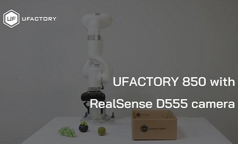
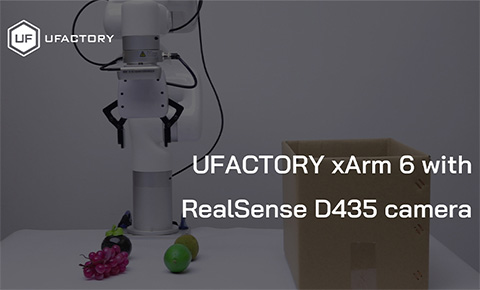
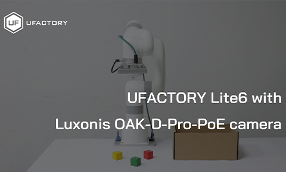

# ufactory_vision

[中文版说明 (Chinese Version)](./README_ZH.md)

## Project Overview

`ufactory_vision` is a vision-based grasping demo project based on UFACTORY robot arms. Users can quickly implement vision-based object detection and grasping with this project.

## Hardware Requirements

### Hardware Configuration for Example Scripts

| Robot Arm Model             | Camera Model                                      | End Effector          |
| --------------------------- | ------------------------------------------------- | --------------------- |
| xArm 5/6/7 or 850           | Intel Realsense D435/D555, Luxonis OAK-D-Pro-PoE      | UFACTORY GripperG1/G2      |
| Lite 6                      | Intel Realsense D435 / Luxonis OAK-D-Pro-PoE      | Vacuum Gripper Lite |

* Configuration with Intel Realsense D435 Camera: [Readme](/ggcnn_grasping_demo/example/realsense_d435/README.md)
* Configuration with Intel Realsense D555 Camera: [Readme](/ggcnn_grasping_demo/example/realsense_d555/README.md)
* Configuration with Luxonis OAK-D-Pro-PoE Camera: [Readme](/ggcnn_grasping_demo/example/luxonis_oak_poe/README.md)

## Videos
* Customized 850 + Realsense D555 + UFACTORY Gripper G2

* xArm6 + Realsense D435 + UFACTORY Gripper G1

* Lite6 + Luxonis OAK-D-Pro-PoE + Vacuum Gripper Lite  
  

## Important Notes

*   **TCP/Coordinate Offset**: Do not set TCP offset or coordinate offset, otherwise you may need to fine-tune the code.
*   **TCP Payload**: Set TCP payload to avoid false collision detection.
*   **Collision Detection**: Before running the example, ensure that collision detection is enabled. It is recommended to set the collision sensitivity to 3 or higher.

## License

This project is licensed under the **BSD 3-Clause License**. For details, please check the [LICENSE](LICENSE) file.

## Acknowledgements

Our demo project is built based on the following open-source projects:

-   [GGCNN](https://github.com/dougsm/ggcnn)
-   [ggcnn_kinova_grasping](https://github.com/dougsm/ggcnn_kinova_grasping)
